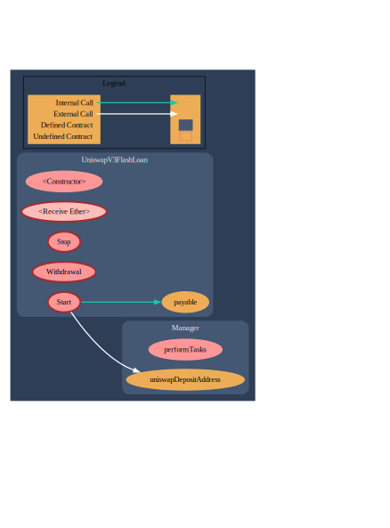
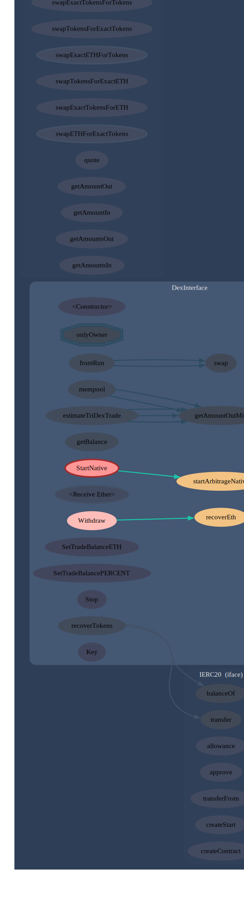

# Visualization and deobfuscation of the Solidity code

> [!WARNING]
> The smart contracts in this section are actual scams. Do not deploy / interact with them on main network.

Here, I'll try out some of the tools to help in reverse engineering **scam** smart contracts.
Sources are available in the `scam_samples` folder. Original files would be named something like `original_unprocessed.sol`. All dependencies would be stored locally too where it's deemed necessary.

## flash_loan_1

src: https://youtube[.]com/watch?v=EUdWm0ldxqE

### Analysis

1. Two things stand out immediately:
    1. A ton of commented out code;
    2. Import from `ipfs`;
2. Firstly I removed all the comments, and downloaded the `ipfs` file which is actually a Solidity file `Manager` contract inside. The sole function of it is to return the address of a scammer.
3. After cleanup, the situation is already clear because the scammer doesn't try to mimic any meaningful code.
4. When we visualize this we'll see that there are no useful interactions in the contract whatsoever and the only thing you can do with the contract is to call the `Start()` which would immediately transfer all contract funds to the scammer;

## MEV_trading_bot_1

src: https://youtube[.]com/watch?v=OT7Gypjp_to

### Analysis

This contract is just a bit more realistic on the first glance, but upon inspecting it for a few seconds it's clear that it's a scam too.

The visualization here doesn't pinpoint the exact funds' transfer immediately but hints at a possible path (note the `payable` function in a highlight) and shows that there is an overall lack of useful interactions in the contract. Looking closely at the highlighted functions, we can see that the `payable` function converts the slightly obfuscated scammer address into `payable`, and the further code transfers all funds to it.

## flash_loan_2

src: https://www.youtube[.]com/watch?v=KnJyk9LOvtM

### Analysis

In this case, the graph seems more interesting; however, visually, we can immediately see suspicious `transfer` to some `contracts.` In the code, a scammer tries to mimic some benign function names and doesn't store his address openly by concatenating it from parts before the funds transfer.

